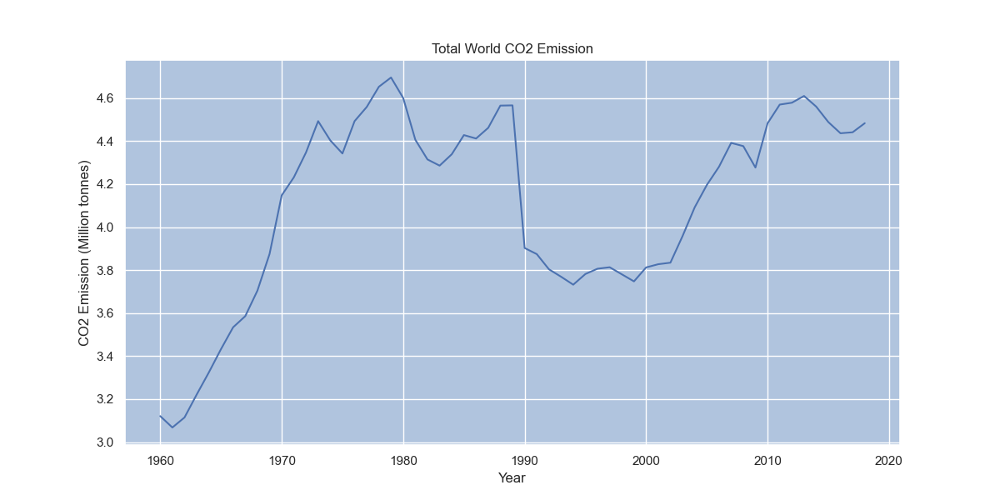
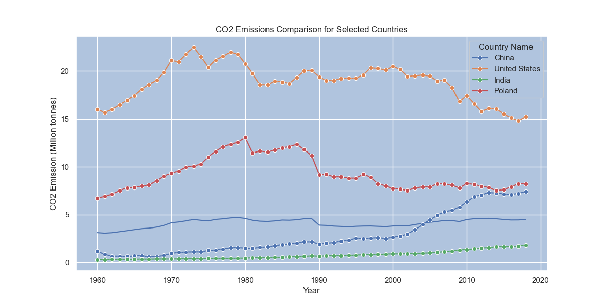

# data_engineering_projects
This is a repo for sample data engineering projects with some interesting data. 
## Project 1. 
# Analysis of Global CO2 Emissions (1960-2018)

This project analyzes historical CO2 emissions data from 1960 to 2018. The primary goal is to explore and visualize trends in carbon emissions, both on a global scale and for specific countries of interest.

## 1. Global CO2 Emissions Trend

The first analysis looks at the total CO2 emissions for the entire world over the nearly 60-year period.

**Key Finding:** As the plot shows, there has been a significant and steady increase in global CO2 emissions since 1960.

## 2. Comparing Emissions of Key Countries

Next, the analysis zooms in on four specific countries: China, the United States, India, and Poland. This comparison highlights the different emission trajectories of major global players.

**Key Finding:** [Describe your key finding here. For example: The data shows a dramatic increase in China's emissions post-2000, while emissions in the United States show a slight decline in later years.]

